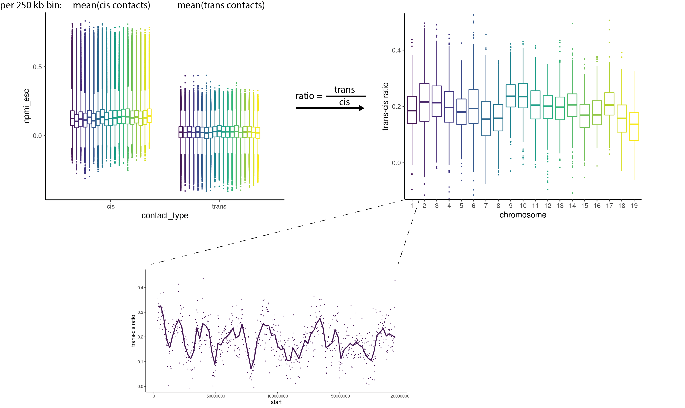

# GAM TRANS-CIS RATIOS

_Calculation of trans-cis NPMI ratios from GAM data_

[](https://www.nature.com/articles/s41586-021-04081-2)



Calculation of trans-cis NPMI ratios per 250 kb bins for Genome Architecture Mapping (GAM) data from mouse oligodendroglia (OLG) from the somatosensory cortex, dopaminergic neurons (DNs) from the midbrain VTA, pyramidal glutamatergic neurons (PGNs) from the hippocampus CA1 and embryonic stem cells (ESCs).  
Ratio discretization to percentile per chromosome and calculation of median trans-cis ratio per long gene to identify preferential decrease in ratio of [long melting genes](https://www.biorxiv.org/content/10.1101/2020.04.02.020990v1). 


### Required packages
```r
library(tidyverse)
library(ggpubr)
library(lemon)
```

### Available scripts
- code/calculate_trans_cis_ratio.R:  
   Calculates trans-cis NPMI ratios for GAM data genome-wide for all cell-types and replicates.   
- code/plot_trans_cis_raincloud.R:  
   Plots trans-cis ratio of long genes in the different cell-types stratified by melting.   


Developed and tested with R version 3.6.0 Planting of a Tree  
Please get in touch for questions and issues: dominik.szabo at mdc-berlin.de


Please check our manuscript:  
__Winick-Ng, W., Kukalev, A., Harabula, I., Zea Redondo, L., Szabo, D. et al.:  
[Cell-type specialization is encoded by specific chromatin topologies](https://www.nature.com/articles/s41586-021-04081-2)__


